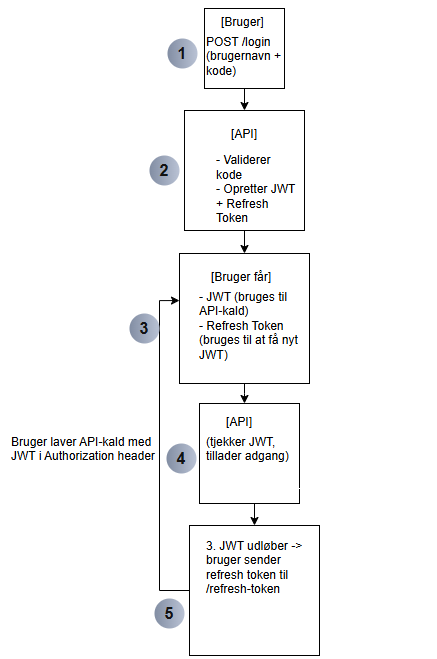

# Secure To-Do Application

A secure REST API and React frontend for managing personal to-do tasks, with a strong focus on authentication, authorization, and security best practices.

---

## 📋 Table of Contents

- [Features](#features)
- [Security](#security)
- [Architecture](#architecture)
- [Setup & Running](#setup--running)
- [API Documentation](#api-documentation)
- [Testing](#testing)
- [Threat Modeling (STRIDE)](#threat-modeling-stride)
- [Screenshots & Diagrams](#screenshots--diagrams)
- [Contributors](#contributors)

---

## 🚀 Features

- User registration and login with strong password policy
- JWT authentication with refresh tokens
- CRUD operations for personal to-do tasks
- User-based access control (users can only access their own data)
- Password hashing with salt
- Brute-force protection (account lockout)
- Input validation and global error handling
- Secure React frontend with protected routes

---

## 🔒 Security

- **Password Hashing:** Secure hashing with salt (never store plain passwords)
- **JWT Authentication:** Access and refresh tokens with expiration
- **Authorization:** [Authorize] attributes and user ID checks
- **Input Validation:** DataAnnotations and backend checks
- **Brute-force Protection:** Account lockout after failed attempts
- **CORS & HTTPS:** Only allow trusted origins, enforce HTTPS
- **No Sensitive Data in Errors:** Global error middleware
- **SQL Injection Protection:** Entity Framework and parameterized queries

---

## 🏗️ Architecture

- **Backend:** ASP.NET Core Web API
- **Frontend:** React (with Axios for API calls)
- **Database:** PostgreSQL (via Entity Framework Core)
- **Testing:** xUnit, Moq (unit tests), Postman (API tests)

---

## ⚙️ Setup & Running

### Prerequisites

- [.NET 9 SDK](https://dotnet.microsoft.com/download)
- [Node.js & npm](https://nodejs.org/)
- [PostgreSQL](https://www.postgresql.org/download/)

### Backend

```sh
cd SecureTodoApi
dotnet restore
dotnet ef database update   
dotnet run
```

### Frontend

```sh
cd secure-todo-frontend
npm install
export HTTPS=true && npm start
```

### Configuration

- Set your connection string and JWT secret in `appsettings.Development.json`.

---

## 📖 API Documentation

- Swagger UI available at: `https://localhost:5001/swagger` (if enabled)
- See the included Postman collection for example requests and tests.

---

## 🧪 Testing

### API Testing (Postman)

- Collection covers registration, login, CRUD, and security edge cases.
- Includes black-box tests (equivalence partitioning, boundary value analysis).

### Unit Testing

```sh
cd SecureTodoApi.Tests
dotnet test
```
- xUnit and Moq used for service layer tests.

---

## 🛡️ Threat Modeling (STRIDE)

- **Spoofing:** JWT authentication, user ID checks
- **Tampering:** Input validation, authorization
- **Repudiation:** Logging (if enabled)
- **Information Disclosure:** No sensitive data in errors
- **Denial of Service:** Brute-force lockout, validation
- **Elevation of Privilege:** User-based access control

---

## 🖼️ Screenshots & Diagrams

- 
- 
- 
- 
- 

---

## 👤 Contributors

- [Marcelo Hani/Basam Dawi](https://github.com/Bigdeal99/to-do-applikation)

---


